# API Call Sequence Diagram: Voice Processing Flow

This document shows the detailed sequence of API calls and WebSocket messages that occur during a complete voice interaction cycle.

## 🎯 Overview

This sequence diagram illustrates the exact order of operations, API calls, and data flow when a user speaks to the voice assistant and receives a response.

## 📊 Complete API Call Sequence

```mermaid
sequenceDiagram
    participant U as User
    participant F as Frontend (Next.js)
    participant WS as WebSocket
    participant B as Backend (FastAPI)
    participant VP as VoicePipeline
    participant W as Whisper STT
    participant G as GPT-4o-mini
    participant DB as MongoDB
    participant T as TTS
    participant A as Audio Player

    Note over U,A: Voice Input Phase
    U->>F: Clicks microphone button
    F->>F: startRecording()
    F->>F: WavRecorder.record()
    F->>F: Audio chunks collected
    U->>F: Stops recording
    F->>F: stopRecording() → Int16Array
    F->>F: arrayBufferToBase64(audio.buffer)

    Note over F,WS: WebSocket Communication Phase
    F->>WS: WebSocket.send({type: "history.update", inputs: history})
    F->>WS: WebSocket.send({type: "input_audio_buffer.append", delta: base64Audio})
    F->>WS: WebSocket.send({type: "input_audio_buffer.commit"})

    Note over WS,B: Backend Processing Phase
    WS->>B: WebSocket message received
    B->>B: is_new_audio_chunk() → true
    B->>B: extract_audio_chunk() → audio_data
    B->>B: audio_buffer.append(audio_data)
    WS->>B: WebSocket message: input_audio_buffer.commit
    B->>B: is_audio_complete() → true
    B->>B: concat_audio_chunks(audio_buffer) → AudioInput

    Note over B,VP: VoicePipeline Processing
    B->>VP: VoicePipeline.run(audio_input)
    VP->>W: Audio → Text conversion
    W-->>VP: Transcribed text
    VP->>G: Process text with agent
    G->>G: Analyze intent and context
    G->>G: Execute function tools (if needed)
    G->>DB: Database operations (if needed)
    DB-->>G: Database response
    G-->>VP: Generated response text
    VP->>T: Text → Audio conversion
    T-->>VP: Audio response

    Note over VP,A: Response Streaming Phase
    VP->>B: Stream audio events
    B->>B: transform_data_to_events(audio_np)
    B->>WS: WebSocket.send({type: "response.audio.delta", delta: base64Audio})
    WS->>F: WebSocket message received
    F->>F: base64ToArrayBuffer(data.delta)
    F->>F: new Int16Array(audioData)
    F->>A: playAudio(audioData)
    A->>A: WavStreamPlayer.add16BitPCM()
    A->>A: Audio playback starts

    Note over F,U: UI Update Phase
    F->>F: setHistory(updatedHistory)
    F->>F: setAgentName(agentName)
    F->>F: setIsLoading(false)
    F->>U: UI updates with conversation history
    A->>U: Audio response plays

    Note over U,A: End of Interaction
    VP->>B: Audio streaming complete
    B->>WS: WebSocket.send({type: "audio.done"})
    WS->>F: audio.done message
    F->>F: onAudioDone() callback
    A->>A: Audio playback stops
```



## 🔄 Detailed Message Flow

### Phase 1: Voice Input Capture


### Phase 2: WebSocket Message Transmission

```mermaid
sequenceDiagram
    participant F as Frontend
    participant WS as WebSocket
    participant B as Backend

    F->>F: arrayBufferToBase64(audio.buffer)
    F->>WS: {type: "history.update", inputs: history}
    WS->>B: Message received
    B->>B: Update connection.history
    
    F->>WS: {type: "input_audio_buffer.append", delta: base64Audio}
    WS->>B: Message received
    B->>B: is_new_audio_chunk() → true
    B->>B: extract_audio_chunk()
    B->>B: audio_buffer.append(audio_data)
    
    F->>WS: {type: "input_audio_buffer.commit"}
    WS->>B: Message received
    B->>B: is_audio_complete() → true
    B->>B: Process complete audio
```



### Phase 3: Backend Processing Pipeline


### Phase 4: Response Streaming


## 📡 WebSocket Message Types

### Outgoing Messages (Frontend → Backend)

```typescript
// 1. History Update
{
  type: "history.update",
  inputs: Message[],
  reset_agent?: boolean
}

// 2. Audio Chunk
{
  type: "input_audio_buffer.append",
  delta: string  // base64 encoded audio
}

// 3. Audio Complete
{
  type: "input_audio_buffer.commit"
}
```

### Incoming Messages (Backend → Frontend)

```typescript
// 1. History Updated
{
  type: "history.updated",
  reason: "user.input" | "response.text.delta" | "response.done",
  inputs: Message[],
  agent_name: string,
  sync?: boolean
}

// 2. Audio Response Chunk
{
  type: "response.audio.delta",
  delta: string,  // base64 encoded audio
  output_index: number,
  content_index: number,
  item_id: string,
  response_id: string,
  event_id: string
}

// 3. Audio Complete
{
  type: "audio.done"
}
```

## 🔧 Function Tool Execution Sequence


## ⚡ Performance Metrics

### Timing Breakdown
- **Audio Recording**: ~2-5 seconds (user dependent)
- **WebSocket Transmission**: ~50-100ms
- **Whisper STT**: ~1-3 seconds
- **GPT-4o Processing**: ~500ms-2 seconds
- **Function Tool Execution**: ~100-500ms
- **TTS Generation**: ~1-2 seconds
- **Audio Streaming**: Real-time chunks
- **Audio Playback**: Real-time

### Latency Optimization Points
1. **Audio Chunking**: 512 sample buffer size
2. **Parallel Processing**: STT and TTS can overlap
3. **Streaming**: Audio response streams as generated
4. **WebSocket**: Low-latency bidirectional communication

## 🚨 Error Handling Sequences

### WebSocket Connection Failure


### Microphone Permission Denied


## 🔍 Debugging Sequence Points

### Key Monitoring Points
1. **WebSocket Connection Status**
2. **Audio Buffer Accumulation**
3. **Function Tool Execution**
4. **Database Operation Success**
5. **Audio Streaming Latency**
6. **TTS Generation Time**

### Common Failure Points
1. **WebSocket Connection**: Backend not running
2. **Microphone Access**: Browser permissions
3. **Audio Quality**: Sample rate mismatch
4. **API Keys**: Invalid OpenAI credentials
5. **Database Connection**: MongoDB unavailable

This sequence diagram provides a complete technical reference for understanding the exact flow of data and API calls in the voice processing system.
