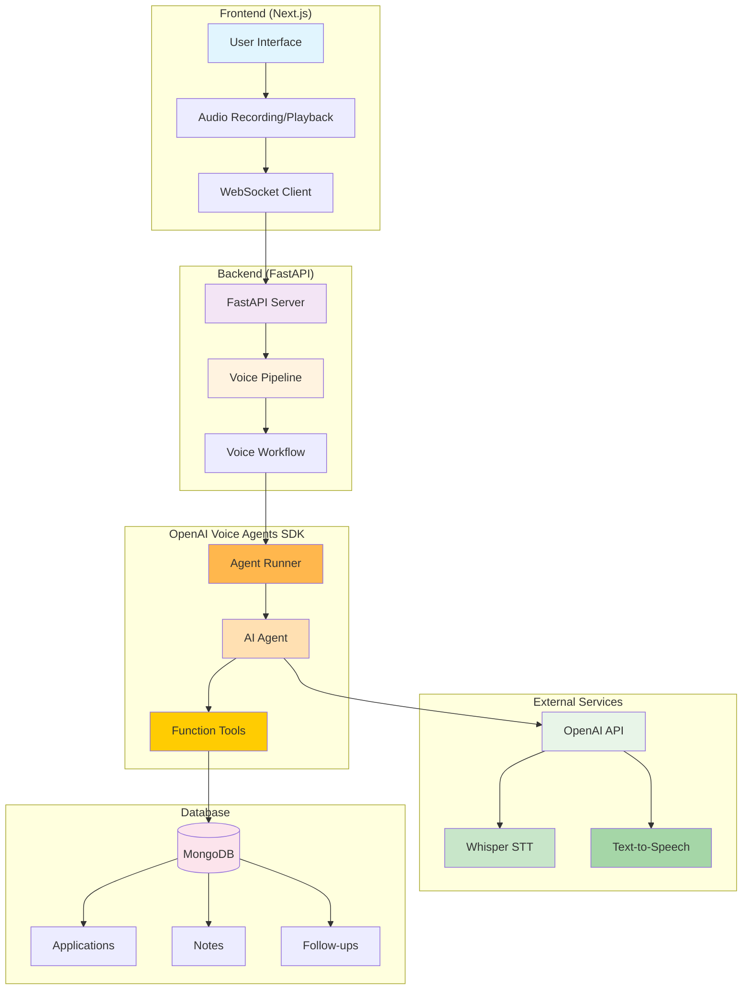

# Job Application Tracker - Voice AI Assistant

[](LICENSE)


A voice-powered job application tracking system built with OpenAI's Voice Agents SDK, FastAPI, Next.js, and MongoDB. This project demonstrates how to create a speech-to-speech AI assistant for managing job applications through natural voice commands.

## 🎯 Features

- **Voice-First Interface**: Natural voice commands for all operations
- **Job Application Management**: Add, update, and track applications through the hiring pipeline
- **Smart Deduplication**: Prevents duplicate applications within 14-day window
- **Multi-tenant Database**: Supports multiple users with proper data isolation
- **Real-time Updates**: WebSocket-based communication for instant feedback
- **Follow-up Scheduling**: Automated reminders for application follow-ups
- **Search & Filtering**: Find applications by status, company, or time range
- **Pipeline Analytics**: Track application success rates and pipeline health

## 🏗️ Architecture



## 🗣️ Voice Commands

### Adding Applications
- "Add Google Software Engineer in Mountain View"
- "Add Microsoft Data Scientist position"
- "Add a job at Apple for iOS Developer"

### Updating Status
- "Update status to applied for Google"
- "Mark Microsoft application as hr_screen"
- "Change Apple status to tech_screen"

### Adding Notes
- "Add note: Had great conversation with hiring manager"
- "Add note to Google: Recruiter responded positively"
- "Note for Microsoft: Technical interview scheduled"

### Scheduling Follow-ups
- "Schedule follow-up for next Friday"
- "Remind me to follow up with Google tomorrow"
- "Set reminder for Apple application next week"

### Searching & Viewing
- "Show me all my applications"
- "What applications do I have?"
- "Show draft applications"
- "Applications from last week"
- "What's my pipeline status?"

## 🛠️ Tech Stack

- **Backend**: FastAPI, OpenAI Voice Agents SDK, Motor (MongoDB async driver)
- **Frontend**: Next.js 15, TypeScript, Tailwind CSS, wavtools
- **Database**: MongoDB (with indexes for performance)
- **AI**: GPT-4o-mini, OpenAI Whisper (STT), OpenAI TTS
- **Communication**: WebSockets for real-time voice interaction
- **Package Management**: uv (Python), npm (Node.js)

## 📋 Requirements

- Python 3.11+
- Node.js 18+
- MongoDB (local or Atlas)
- OpenAI API key with voice capabilities
- Microphone access

## 🚀 Quick Start

### 1. Clone and Setup
```bash
git clone <your-repo>
cd experiment-openai-speech-to-speech
```

### 2. Environment Configuration
Create a `.env` file in the root directory:
```env
# OpenAI API Configuration
OPENAI_API_KEY=your_openai_api_key_here

# Database Configuration
MONGODB_URI=mongodb://localhost:27017
DATABASE_NAME=job_tracker_speech_to_speech
```

### 3. Install Dependencies
```bash
# Backend dependencies
cd server && uv sync

# Frontend dependencies
cd ../frontend && npm install
```

### 4. Start Development Servers
```bash
# From root directory
make dev
```

Or run separately:
```bash
# Backend (Terminal 1)
cd server && uv run server.py

# Frontend (Terminal 2)
cd frontend && npm run dev
```

### 5. Access Application
- Frontend: http://localhost:3000
- Backend API: http://localhost:8000
- WebSocket: ws://localhost:8000/ws

## 🗄️ Database Schema

### Applications Collection
```javascript
{
  "_id": ObjectId,
  "user_id": ObjectId,           // Multi-tenant support
  "company": "Google",
  "role_title": "Software Engineer",
  "location": "Mountain View, CA",
  "source": "LinkedIn",
  "job_post_url": "https://...",
  "status_stage": "draft",       // draft, applied, hr_screen, tech_screen, onsite, offer, rejected, withdrawn
  "salary_min": 120000,
  "salary_max": 180000,
  "currency": "USD",
  "remote_ok": true,
  "skills_required": ["Python", "React"],
  "job_posted_date": "2024-01-15",
  "company_norm": "google",      // Normalized for deduplication
  "role_title_norm": "software engineer",
  "created_at": ISODate,
  "updated_at": ISODate
}
```

### Notes Collection
```javascript
{
  "_id": ObjectId,
  "application_id": ObjectId,
  "user_id": ObjectId,
  "content": "Had great conversation with hiring manager",
  "created_at": ISODate
}
```

### Followups Collection
```javascript
{
  "_id": ObjectId,
  "application_id": ObjectId,
  "user_id": ObjectId,
  "due_at": ISODate,
  "channel": "email",           // email, linkedin, call
  "status": "pending",          // pending, completed, cancelled
  "note": "Optional note",
  "created_at": ISODate,
  "updated_at": ISODate
}
```

## 🔧 Development Commands

```bash
# Setup
make setup              # Initial setup with .env creation
make sync               # Install/update dependencies

# Development
make dev                # Start both frontend and backend
make frontend           # Start only frontend
make server             # Start only backend

# Production
make build              # Build frontend for production
make start              # Start production server

# Utilities
make clean              # Clean build artifacts
make help               # Show all commands
```

## 🧪 Testing

### Database Connection Test
```bash
cd server && uv run test_db.py
```

### Voice Commands Test
1. Start the application
2. Grant microphone permissions
3. Try voice commands from the examples above
4. Check database for created records

## 🔧 Troubleshooting

### Common Issues

1. **Microphone Access Denied**
   - Check browser permissions
   - Use HTTPS in production
   - Clear browser cache

2. **Database Connection Failed**
   - Verify MongoDB is running
   - Check connection string
   - Ensure database exists

3. **OpenAI API Errors**
   - Verify API key is valid
   - Check API quota
   - Ensure voice capabilities enabled

4. **WebSocket Connection Issues**
   - Check server is running
   - Verify WebSocket URL
   - Check firewall settings

## 🤝 Contributing

1. Fork the repository
2. Create a feature branch
3. Make your changes
4. Test thoroughly
5. Submit a pull request

## 📄 License

This project is licensed under the MIT License - see the [LICENSE](LICENSE) file for details.

## 🙏 Acknowledgments

- OpenAI for the Voice Agents SDK
- FastAPI for the excellent web framework
- Next.js for the frontend framework
- MongoDB for the database solution

## 📞 Support

For questions or issues:
1. Check the troubleshooting section
2. Review the documentation
3. Open an issue on GitHub

---

**Happy Voice-Enabled Job Tracking! 🎤📋**
