# Voice Flow Documentation: Complete User Journey

This document illustrates the complete flow of voice data from user input through the LLM processing pipeline and back to the UI as both text and audio responses.

## 🎯 Overview

The system implements a **speech-to-speech** AI assistant that processes voice input, converts it to text, processes it through an LLM with function tools, and returns both text and audio responses to the user.

## 📊 Complete Flow Diagram

```mermaid
graph TB
    subgraph "Frontend (Next.js)"
        A[User Clicks Mic] --> B[Audio Recording Starts]
        B --> C[WavRecorder Records Audio]
        C --> D[Audio Chunks Collected]
        D --> E[User Stops Recording]
        E --> F[Audio Converted to Int16Array]
        F --> G[Audio Sent via WebSocket]
    end
    
    subgraph "WebSocket Communication"
        G --> H[WebSocket Message: input_audio_buffer.append]
        H --> I[Audio Chunks Accumulated]
        I --> J[WebSocket Message: input_audio_buffer.commit]
    end
    
    subgraph "Backend (FastAPI)"
        J --> K[WebSocket Endpoint Receives Audio]
        K --> L[Audio Chunks Concatenated]
        L --> M[VoicePipeline Processes Audio]
    end
    
    subgraph "OpenAI Voice Agents SDK"
        M --> N[Whisper STT: Audio → Text]
        N --> O[GPT-4o-mini: Text Processing]
        O --> P[Function Tools Execution]
        P --> Q[Response Generation]
        Q --> R[TTS: Text → Audio]
    end
    
    subgraph "Response Flow"
        R --> S[Audio Streamed Back]
        S --> T[WebSocket: response.audio.delta]
        T --> U[Frontend Receives Audio]
        U --> V[WavStreamPlayer Plays Audio]
        V --> W[UI Updates with Text & Audio]
    end
    
    style A fill:#e1f5fe
    style N fill:#c8e6c9
    style O fill:#fff3e0
    style P fill:#ffcc02
    style R fill:#a5d6a7
    style V fill:#fce4ec
```



## 🔄 Detailed Step-by-Step Flow

### Phase 1: Voice Input Capture (Frontend)

#### 1.1 User Interaction
```typescript
// frontend/src/components/AudioChat.tsx
async function toggleRecording() {
  if (isRecording) {
    const audio = await stopRecording();
    sendAudioMessage(audio);  // Send to WebSocket
    setIsRecording(false);
  } else {
    await startRecording();
    setIsRecording(true);
  }
}
```

#### 1.2 Audio Recording Process
```typescript
// frontend/src/hooks/useAudio.ts
async function startRecording() {
  // Initialize WavRecorder with 24kHz sample rate
  wavRecorder.current = new WavRecorder({ sampleRate: 24000 });
  
  // Start recording with callback for real-time frequency analysis
  await wavRecorder.current?.record((data) => {
    audioChunks.current.push(data.mono);  // Store audio chunks
    // Update UI with frequency visualization
    setFrequencies(normalizeArray(updatedFrequencies.values, 30));
  });
}
```

#### 1.3 Audio Processing & Transmission
```typescript
// frontend/src/hooks/useWebsocket.ts
function sendAudioMessage(audio: Int16Array<ArrayBuffer>) {
  // Send history update
  websocket.current?.send(JSON.stringify({
    type: "history.update",
    inputs: history,
  }));
  
  // Send audio data as base64
  websocket.current?.send(JSON.stringify({
    type: "input_audio_buffer.append",
    delta: arrayBufferToBase64(audio.buffer),
  }));
  
  // Commit the audio buffer
  websocket.current?.send(JSON.stringify({
    type: "input_audio_buffer.commit",
  }));
}
```

### Phase 2: WebSocket Communication

#### 2.1 Message Types
The system uses three main WebSocket message types:

1. **`history.update`** - Syncs conversation history
2. **`input_audio_buffer.append`** - Sends audio chunks
3. **`input_audio_buffer.commit`** - Signals end of audio input

#### 2.2 Audio Buffer Management
```python
# server/server.py
audio_buffer = []  # Accumulates audio chunks

# Handle incoming audio chunks
elif is_new_audio_chunk(message):
    audio_buffer.append(extract_audio_chunk(message))

# Process complete audio when committed
elif is_audio_complete(message):
    audio_input = concat_audio_chunks(audio_buffer)
    # Process through VoicePipeline
```

### Phase 3: Backend Processing (FastAPI)

#### 3.1 WebSocket Endpoint
```python
# server/server.py
@app.websocket("/ws")
async def websocket_endpoint(websocket: WebSocket):
    await websocket.accept()
    connection = WebsocketHelper(websocket, [], starting_agent)
    audio_buffer = []
    
    workflow = Workflow(connection)
    # Main message processing loop
```

#### 3.2 Audio Processing Pipeline
```python
# server/server.py
audio_input = concat_audio_chunks(audio_buffer)
output = await VoicePipeline(
    workflow=workflow,
    config=VoicePipelineConfig(
        tts_settings=TTSModelSettings(
            buffer_size=512, 
            transform_data=transform_data
        )
    ),
).run(audio_input)
```

### Phase 4: OpenAI Voice Agents SDK Processing

#### 4.1 Speech-to-Text (Whisper)
```python
# The VoicePipeline automatically handles:
# 1. Audio → Text conversion using Whisper
# 2. Text processing through the configured agent
# 3. Function tool execution
# 4. Text → Audio conversion using TTS
```

#### 4.2 Agent Processing
```python
# server/app/agent_config.py
job_tracking_agent = Agent(
    name="Job Application Tracker",
    instructions="You are a helpful job application tracking assistant...",
    model="gpt-4o-mini",
    tools=[
        add_job_application,
        update_application_status_by_reference,
        add_note_to_application_by_reference,
        schedule_followup_by_reference,
        search_job_applications,
        get_all_applications,
        get_pipeline_summary
    ],
)
```

#### 4.3 Function Tool Execution
```python
# Example: When user says "Add Google Software Engineer"
@function_tool
async def add_job_application(company: str, role_title: str, ...):
    # Process the request
    result = await create_application_with_dedup(app_data)
    
    # Return structured response
    return json.dumps({
        "success": True,
        "message": result["message"],
        "application_id": result["application_id"]
    })
```

### Phase 5: Response Generation & Streaming

#### 5.1 Audio Response Streaming
```python
# server/server.py
async for event in output.stream():
    await connection.send_audio_chunk(event)
```

#### 5.2 Audio Data Format
```python
# server/app/utils.py
def transform_data_to_events(audio_np: np.ndarray) -> dict:
    return {
        "type": "response.audio.delta",
        "delta": base64.b64encode(audio_np.tobytes()).decode("utf-8"),
        "output_index": 0,
        "content_index": 0,
        "item_id": "",
        "response_id": "",
        "event_id": "",
    }
```

### Phase 6: Frontend Response Handling

#### 6.1 WebSocket Message Processing
```typescript
// frontend/src/hooks/useWebsocket.ts
ws.addEventListener("message", (event) => {
  const data = JSON.parse(event.data);
  
  if (data.type === "history.updated") {
    // Update conversation history
    setHistory(data.inputs);
    setAgentName(data.agent_name);
  } 
  else if (data.type === "response.audio.delta") {
    // Process incoming audio chunks
    const audioData = new Int16Array(base64ToArrayBuffer(data.delta));
    if (typeof onNewAudio === "function") {
      onNewAudio(audioData);  // Play audio
    }
  } 
  else if (data.type === "audio.done") {
    // Signal end of audio response
    if (typeof onAudioDone === "function") {
      onAudioDone();
    }
  }
});
```

#### 6.2 Audio Playback
```typescript
// frontend/src/hooks/useAudio.ts
const playAudio = useCallback((audio: Int16Array<ArrayBuffer>) => {
  if (wavPlayer.current) {
    wavPlayer.current.add16BitPCM(audio, trackId.current ?? undefined);
    window.requestAnimationFrame(getFrequencies);  // Update visualization
  }
}, [getFrequencies]);
```

## 🎵 Audio Specifications

### Input Audio
- **Sample Rate**: 24,000 Hz
- **Format**: 16-bit PCM
- **Channels**: Mono
- **Encoding**: Base64 for WebSocket transmission

### Output Audio
- **Sample Rate**: 24,000 Hz
- **Format**: 16-bit PCM
- **Channels**: Mono
- **Streaming**: Real-time chunks via WebSocket

## 🔧 Key Components

### Frontend Components
1. **`useAudio.ts`** - Audio recording and playback
2. **`useWebsocket.ts`** - WebSocket communication
3. **`AudioChat.tsx`** - Voice input interface
4. **`AudioPlayback.tsx`** - Audio visualization

### Backend Components
1. **`server.py`** - WebSocket endpoint and main server
2. **`agent_config.py`** - AI agent and function tools
3. **`utils.py`** - Audio processing utilities
4. **`database.py`** - Data persistence

### External Services
1. **OpenAI Whisper** - Speech-to-text
2. **OpenAI GPT-4o-mini** - Text processing
3. **OpenAI TTS** - Text-to-speech
4. **MongoDB** - Data storage

## ⚡ Performance Considerations

### Latency Optimization
- **Audio Chunking**: Small buffer sizes (512 samples)
- **Streaming**: Real-time audio streaming
- **Parallel Processing**: Concurrent STT and TTS

### Error Handling
- **WebSocket Reconnection**: Automatic retry on connection loss
- **Audio Fallback**: Graceful degradation to text-only
- **Microphone Permissions**: User-friendly error messages

## 🚀 Example User Journey

1. **User**: Clicks microphone button
2. **System**: Starts recording audio at 24kHz
3. **User**: Says "Add Google Software Engineer position"
4. **System**: Sends audio chunks via WebSocket
5. **Backend**: Processes through VoicePipeline
6. **Whisper**: Converts audio to text
7. **GPT-4o**: Processes text and calls `add_job_application` function
8. **Database**: Creates new job application record
9. **TTS**: Converts response to audio
10. **Frontend**: Plays audio response and updates UI
11. **User**: Hears "I've added Google Software Engineer to your applications"

## 🔍 Debugging Tips

### Common Issues
1. **WebSocket Connection**: Check if backend is running on port 8000
2. **Microphone Access**: Verify browser permissions
3. **Audio Quality**: Ensure 24kHz sample rate
4. **API Keys**: Verify OpenAI API key is valid

### Monitoring Points
- WebSocket connection status
- Audio buffer accumulation
- Function tool execution
- Database operations
- Audio streaming latency

This flow demonstrates a sophisticated real-time voice processing system that seamlessly integrates multiple AI services to provide a natural conversational experience.
